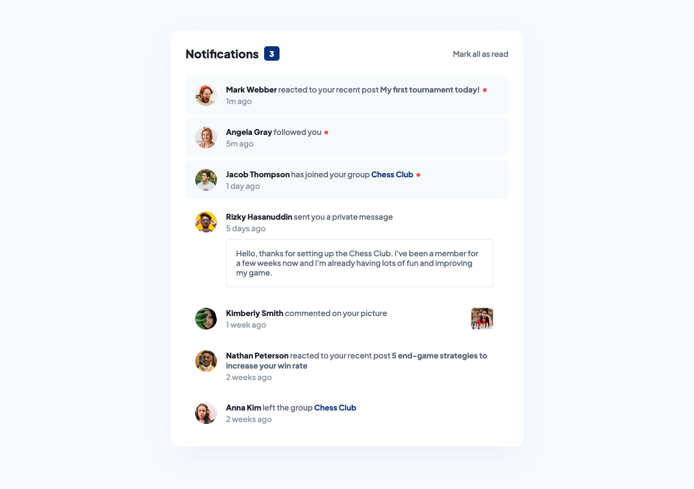

# Notifications page solution

This is a solution to the [Notifications page challenge on Frontend Mentor](https://www.frontendmentor.io/challenges/notifications-page-DqK5QAmKbC). Frontend Mentor challenges help you improve your coding skills by building realistic projects.

- [View demo here 🔎](https://ionstici.github.io/notifications-page)
- [Solution published on Frontend Mentor](https://www.frontendmentor.io/solutions/notifications-page-6I73f9XXxe)

## About the project

A simple coding challenge to put your vanilla HTML, CSS and JavaScript skills at test.

## Features

- Responsive design using CSS media queries
- JavaScript Interactivity - you can mark notifications as read, or mark them as unread by clicking a profile picture,
- Highlight unread notifications by clicking the box that displays the number of notifications.

## Built with

- HTML5 for structuring the component
- Vanilla CSS for styles
- Flexbox and CSS Grid for layout
- Mobile-first workflow
- JavaScript for making the component interactive

## Getting Started

```bash
git clone https://github.com/ionStici/notifications-page.git
cd notifications-page
live-server
# Open localhost:8000 to view the project
```

The main files that comprise the project are `index.html`, `style.css` and `script.js`.

## Screenshot


